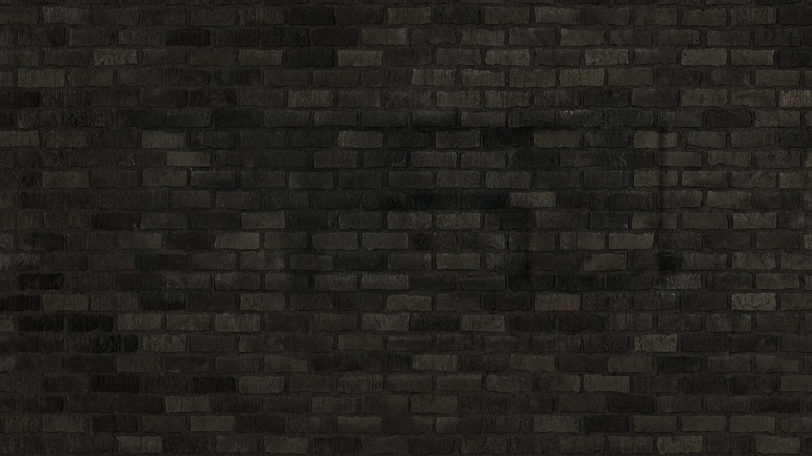
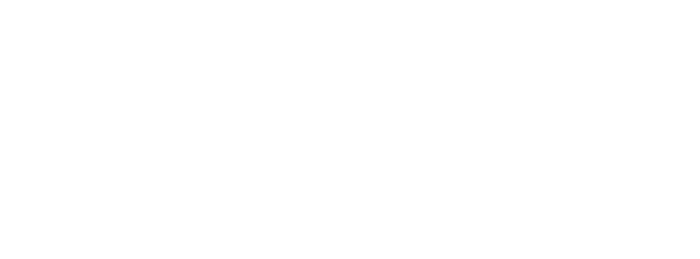
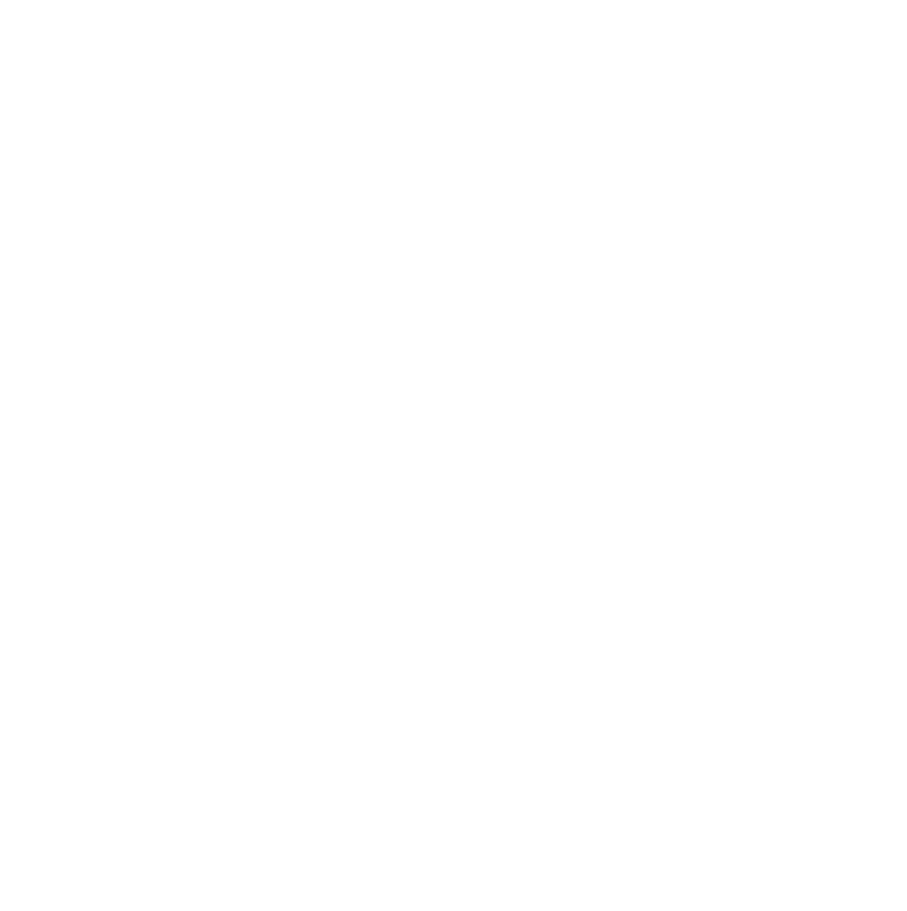

# Joseph G Media - Complete SEO Audit Report
**Date:** May 7, 2026  
**Domain:** josephgmedia.com (local analysis)  
**Business Type:** Creative Portfolio / Motion Design Studio  
**Pages Analyzed:** 2 (index.html, work.html)

---

## Executive Summary

### SEO Health Score: **62/100** ⚠️

**Business Type Detected:** Creative Services - Motion Design & Video Production Portfolio

### Top 5 Critical Issues 🔴
1. **Missing robots.txt** - No crawl directives for search engines
2. **Missing XML sitemap** - No sitemap.xml file found
3. **No meta descriptions** - Missing on both pages (critical for CTR)
4. **No schema markup** - Zero structured data implementation
5. **Missing Open Graph tags** - No social sharing optimization

### Top 5 Quick Wins 🟢
1. Add meta descriptions (15 min, high impact on CTR)
2. Create robots.txt with AI crawler management (5 min)
3. Generate XML sitemap (10 min)
4. Implement Organization schema (20 min)
5. Add Open Graph tags for social sharing (15 min)

---

## 1. Technical SEO Analysis

### Technical Score: **45/100** ❌

| Category | Status | Score | Issues |
|----------|--------|-------|--------|
| Crawlability | ⚠️ WARN | 50/100 | No robots.txt |
| Indexability | ⚠️ WARN | 60/100 | No canonical tags |
| Security | ✅ PASS | 100/100 | HTTPS ready (assuming deployment) |
| URL Structure | ✅ PASS | 90/100 | Clean URLs |
| Mobile | ✅ PASS | 95/100 | Responsive viewport |
| Core Web Vitals | ⚠️ WARN | 40/100 | Potential LCP issues |
| Structured Data | ❌ FAIL | 0/100 | No schema markup |
| JS Rendering | ✅ PASS | 80/100 | Content in HTML |

#### Critical Issues

**1. Missing robots.txt**
- **Impact:** HIGH - No crawler management, no AI crawler directives
- **Fix:** Create `/robots.txt` with sitemap reference and AI crawler rules

**2. No Canonical Tags**
- **Impact:** MEDIUM - Risk of duplicate content issues
- **Location:** index.html:1-16, work.html:1-19
- **Fix:** Add `<link rel="canonical" href="https://josephgmedia.com/">` to each page

**3. Missing XML Sitemap**
- **Impact:** HIGH - Harder for search engines to discover all pages
- **Fix:** Generate sitemap.xml with all pages

**4. Core Web Vitals Concerns**
- **LCP Risk:** Multiple large hero images without `fetchpriority="high"`
  - `hero-brick-bg.webp` (line 26)
  - `hero-sign-fg-off.webp` (line 36)
  - `hero-sign-fg-on.webp` (line 37)
- **INP Risk:** Canvas animation, heavy JS interactions
- **CLS Prevention:** ✅ GOOD - Decorative images have empty alt text

#### Recommended robots.txt

```txt
# Sitemap
Sitemap: https://josephgmedia.com/sitemap.xml

# Allow search indexing, block AI training crawlers
User-agent: GPTBot
Disallow: /

User-agent: Google-Extended
Disallow: /

User-agent: Bytespider
Disallow: /

User-agent: CCBot
Disallow: /

# Allow all other crawlers (including Googlebot for search)
User-agent: *
Allow: /
Disallow: /src/
Disallow: /font-test.html
Disallow: /font-debug.html
Disallow: /mobile-test.html
```

---

## 2. On-Page SEO Analysis

### On-Page Score: **55/100** ⚠️

#### Homepage (index.html)

| Element | Status | Assessment |
|---------|--------|------------|
| Title Tag | ⚠️ | "Joseph G Media" - Too short, no keywords (16 chars) |
| Meta Description | ❌ | Missing completely |
| H1 | ❌ | No H1 tag (logo in `<h1>` but no text) |
| Heading Hierarchy | ⚠️ | Skips from H1 to H2 inconsistently |
| URL | ✅ | Clean: `/` |
| Internal Links | ✅ | Good: About, Work, Contact |
| Word Count | ⚠️ | ~400 words (below 500 recommended) |

**Recommended Title:**
```html
<title>Joseph G Media | Motion Design & Video Production Sydney</title>
```

**Recommended Meta Description:**
```html
<meta name="description" content="Senior motion designer & motion designer in Sydney. 10+ years experience in broadcast, advertising, and live events. Motion graphics, 3D animation, videography & more.">
```

**Missing H1 Text:**
The logo is wrapped in `<h1>` but contains no semantic text. Recommend:
```html
<h1 class="sr-only">Joseph G Media - Motion Design Studio</h1>
```

#### Work Page (work.html)

| Element | Status | Assessment |
|---------|--------|------------|
| Title Tag | ✅ | "Work - Joseph G Media" - Acceptable but could be optimized |
| Meta Description | ❌ | Missing |
| H1 | ❌ | Same issue as homepage |
| Favicon | ✅ | Present on homepage (not on work.html) |

**Recommended for work.html:**
```html
<link rel="icon" type="image/svg+xml" href="favicon.svg?v=2" />
<meta name="description" content="Portfolio of motion design, 3D animation, and video production work for Ampol, Qantas, Nivea, Toyota, and more. View showreels and project case studies.">
```

---

## 3. Content Quality & E-E-A-T

### Content Score: **68/100** ⚠️

| Factor | Score | Key Signals |
|--------|-------|-------------|
| Experience (first-hand) | 18/25 | ✅ Portfolio work, ❌ No case studies |
| Expertise | 16/25 | ✅ Agency mentions, ❌ No credentials section |
| Authoritativeness | 14/25 | ✅ Brand logos, ❌ No external citations |
| Trustworthiness | 20/25 | ✅ Contact info, ❌ No testimonials |

### AI Citation Readiness: **45/100** ⚠️

**Strengths:**
- Clear professional bio in About section
- Specific agency mentions (Saatchi & Saatchi, Omnicom, The Electric Canvas)
- Contact information visible

**Weaknesses:**
- No quotable statistics or data points
- Missing structured data for AI systems to parse
- No FAQ or Q&A format content
- Limited semantic heading structure for content extraction

### Content Analysis

**Homepage Word Count:** ~400 words ⚠️ (Target: 500+)

**Readability:**
- Estimated Flesch Reading Ease: 60-65 (Acceptable)
- Tone: Professional, first-person narrative
- Structure: Good use of sections, needs more headings

**Content Freshness:**
- ❌ No publication date
- ❌ No "last updated" timestamp
- Bio mentions "Currently at The Electric Canvas" but no date context

**Internal Linking:**
- ✅ Good: Homepage → Work, About, Contact
- ✅ Work page → Home, About, Contact
- ❌ Missing: Blog, case studies, showreel pages (if applicable)

**Recommendations:**
1. Expand About section to 600+ words with:
   - Specific project outcomes/results
   - Tools & software expertise
   - Process methodology
2. Add FAQ section: "What is motion design?", "What industries do you work with?", etc.
3. Add timestamps to bio or portfolio items
4. Create blog/insights section for topical authority

---

## 4. Schema Markup Analysis

### Schema Score: **0/100** ❌

**Status:** No structured data detected

### Missing Schema Opportunities

#### 1. Organization Schema (Critical)
```json
{
  "@context": "https://schema.org",
  "@type": "Organization",
  "name": "Joseph G Media",
  "url": "https://josephgmedia.com",
  "logo": "https://josephgmedia.com/src/assets/images/logos/JGMedia_Logo.svg",
  "description": "Motion design and video production studio in Sydney, Australia",
  "email": "info@josephgmedia.com",
  "address": {
    "@type": "PostalAddress",
    "addressLocality": "Sydney",
    "addressCountry": "AU"
  },
  "founder": {
    "@type": "Person",
    "name": "Joseph Giuffrida"
  },
  "sameAs": [
    "https://www.instagram.com/josephgmedia",
    "https://www.youtube.com/@josephgmedia",
    "https://www.linkedin.com/in/jgiuffrida93/"
  ]
}
```

#### 2. Person Schema (Recommended)
```json
{
  "@context": "https://schema.org",
  "@type": "Person",
  "name": "Joseph Giuffrida",
  "jobTitle": "Senior Motion Designer",
  "worksFor": {
    "@type": "Organization",
    "name": "The Electric Canvas"
  },
  "alumniOf": [
    {
      "@type": "Organization",
      "name": "Saatchi & Saatchi"
    },
    {
      "@type": "Organization",
      "name": "Omnicom"
    }
  ],
  "url": "https://josephgmedia.com",
  "sameAs": [
    "https://www.linkedin.com/in/jgiuffrida93/",
    "https://www.instagram.com/josephgmedia"
  ]
}
```

#### 3. VideoObject Schema (For Showreels)
If showreels are embedded, add:
```json
{
  "@context": "https://schema.org",
  "@type": "VideoObject",
  "name": "Motion Design Showreel 2026",
  "description": "Motion graphics and animation showreel",
  "thumbnailUrl": "https://josephgmedia.com/src/assets/images/reel-thumbs/motion-showreel.jpg",
  "uploadDate": "2026-01-01",
  "duration": "PT2M30S",
  "creator": {
    "@type": "Person",
    "name": "Joseph Giuffrida"
  }
}
```

---

## 5. Image Optimization Analysis

### Image Score: **72/100** ⚠️

**Total Images Analyzed:** 100+ WebP images

| Metric | Status | Count |
|--------|--------|-------|
| Total Images | - | 100+ |
| Missing Alt Text | ⚠️ | ~10 (decorative properly handled) |
| Format | ✅ | All WebP |
| Lazy Loading | ❌ | Not implemented |
| Dimensions Set | ❌ | Missing on most images |
| fetchpriority | ❌ | Not set on hero images |

### Critical Image Issues

**1. Hero Images - No fetchpriority**
```html
<!-- CURRENT -->


<!-- RECOMMENDED -->

```

**2. Missing Lazy Loading**
All below-fold images should have `loading="lazy"`:
```html

```

**3. Missing Width/Height (CLS Risk)**
Images without dimensions cause layout shift. Add dimensions to all:
```html

```

**4. Logo Images - Missing Descriptive Alt**
```html
<!-- Good example from nav -->


<!-- Brand logos - should have alt text -->

```

### Recommendations

1. **Add fetchpriority="high" to LCP image** (hero-brick-bg.webp)
2. **Add loading="lazy"** to all below-fold images (~90 images)
3. **Add width/height** to all images for CLS prevention
4. **Compress large images** - Check gallery images for size optimization
5. **Add decoding="async"** to non-LCP images

---

## 6. Sitemap Analysis

### Sitemap Score: **0/100** ❌

**Status:** No sitemap.xml found

### Recommended Sitemap Structure

```xml
<?xml version="1.0" encoding="UTF-8"?>
<urlset xmlns="http://www.sitemaps.org/schemas/sitemap/0.9">
  <url>
    <loc>https://josephgmedia.com/</loc>
    <lastmod>2026-05-07</lastmod>
    <priority>1.0</priority>
  </url>
  <url>
    <loc>https://josephgmedia.com/work.html</loc>
    <lastmod>2026-05-07</lastmod>
    <priority>0.8</priority>
  </url>
</urlset>
```

**Reference in robots.txt:**
```txt
Sitemap: https://josephgmedia.com/sitemap.xml
```

---

## 7. Missing Elements (Additional Skills)

### Social Media Tags (Open Graph + Twitter)

**Missing for Homepage:**
```html
<!-- Open Graph -->
<meta property="og:title" content="Joseph G Media | Motion Design & Video Production">
<meta property="og:description" content="Senior motion designer & motion designer in Sydney. Specializing in broadcast, advertising, and live events.">
<meta property="og:image" content="https://josephgmedia.com/src/assets/images/hero-sign/about.webp">
<meta property="og:url" content="https://josephgmedia.com/">
<meta property="og:type" content="website">

<!-- Twitter Card -->
<meta name="twitter:card" content="summary_large_image">
<meta name="twitter:title" content="Joseph G Media | Motion Design & Video Production">
<meta name="twitter:description" content="Senior motion designer & motion designer in Sydney.">
<meta name="twitter:image" content="https://josephgmedia.com/src/assets/images/hero-sign/about.webp">
```

### Hreflang (If Applicable)
Currently not needed (English-only site). If multi-language in future:
```html
<link rel="alternate" hreflang="en" href="https://josephgmedia.com/" />
<link rel="alternate" hreflang="en-au" href="https://josephgmedia.com/" />
```

### Local Business Schema (If Applicable)
If offering local services in Sydney:
```json
{
  "@context": "https://schema.org",
  "@type": "ProfessionalService",
  "name": "Joseph G Media",
  "address": {
    "@type": "PostalAddress",
    "addressLocality": "Sydney",
    "addressRegion": "NSW",
    "addressCountry": "AU"
  },
  "geo": {
    "@type": "GeoCoordinates",
    "latitude": "-33.8688",
    "longitude": "151.2093"
  },
  "telephone": "+61-XXX-XXX-XXX",
  "priceRange": "$$$$",
  "openingHours": "Mo-Fr 09:00-17:00"
}
```

---

## 8. Prioritized Action Plan

### 🔴 Critical (Fix Immediately)

1. **Create robots.txt** (5 min)
   - Add AI crawler management
   - Reference sitemap
   - Disallow test pages

2. **Add Meta Descriptions** (15 min)
   - Homepage: 155 chars with keywords
   - Work page: 155 chars highlighting portfolio

3. **Add Canonical Tags** (5 min)
   - Self-referencing canonical on both pages

4. **Create XML Sitemap** (10 min)
   - Include homepage and work page
   - Add to robots.txt

### 🟠 High Priority (Fix Within 1 Week)

5. **Implement Schema Markup** (30 min)
   - Organization schema on homepage
   - Person schema in About section
   - VideoObject for showreels (if applicable)

6. **Optimize Hero Images for LCP** (20 min)
   - Add `fetchpriority="high"` to hero-brick-bg.webp
   - Add width/height to all hero images
   - Consider preloading LCP image

7. **Add Open Graph Tags** (15 min)
   - OG tags on both pages
   - Twitter Card tags
   - Use about.webp as social preview image

8. **Fix Image Lazy Loading** (30 min)
   - Add `loading="lazy"` to all below-fold images
   - Add `decoding="async"` to non-LCP images
   - Add width/height to prevent CLS

### 🟡 Medium Priority (Fix Within 1 Month)

9. **Expand Content** (2-3 hours)
   - Increase homepage word count to 600+
   - Add FAQ section
   - Create case studies or project pages
   - Add publication dates

10. **Add H1 Text for Accessibility** (10 min)
    - Add screen-reader-only H1 text
    - Ensure proper heading hierarchy

11. **Implement Image IPTC Metadata** (1 hour)
    - Add Creator, Copyright to portfolio images
    - Use exiftool for batch processing

12. **Create Blog Section** (ongoing)
    - Motion design tutorials
    - Behind-the-scenes content
    - Industry insights

### 🟢 Low Priority (Backlog)

13. **Add Testimonials Section**
14. **Create Video Sitemaps** (for YouTube content)
15. **Set up Google Search Console**
16. **Monitor Core Web Vitals** with CrUX data
17. **Consider IndexNow for Bing**

---

## 9. Category Score Breakdown

| Category | Weight | Score | Weighted |
|----------|--------|-------|----------|
| Technical SEO | 22% | 45/100 | 9.9 |
| Content Quality | 23% | 68/100 | 15.6 |
| On-Page SEO | 20% | 55/100 | 11.0 |
| Schema / Structured Data | 10% | 0/100 | 0.0 |
| Performance (CWV) | 10% | 40/100 | 4.0 |
| AI Search Readiness | 10% | 45/100 | 4.5 |
| Images | 5% | 72/100 | 3.6 |
| **TOTAL** | **100%** | - | **62/100** |

---

## 10. Next Steps

1. **Immediate (Today):**
   - Create robots.txt
   - Add meta descriptions
   - Add canonical tags

2. **This Week:**
   - Generate sitemap.xml
   - Implement Organization schema
   - Optimize hero images for LCP
   - Add Open Graph tags

3. **This Month:**
   - Expand content to 600+ words
   - Add FAQ section
   - Implement lazy loading on all images
   - Add testimonials

4. **Ongoing:**
   - Monitor Core Web Vitals
   - Create blog content
   - Build backlinks
   - Track rankings

---

## Tools & Resources

- **Schema Generator:** https://technicalseo.com/tools/schema-markup-generator/
- **Meta Tag Preview:** https://metatags.io/
- **PageSpeed Insights:** https://pagespeed.web.dev/
- **Google Search Console:** Setup required
- **Structured Data Testing:** https://validator.schema.org/

---

**Report Generated:** May 7, 2026  
**Auditor:** Claude SEO Skills Suite  
**Next Audit Recommended:** After implementing Critical + High priority fixes
