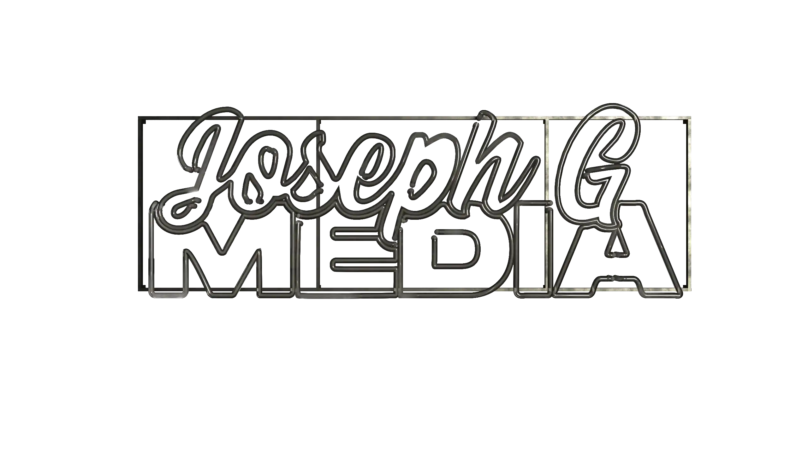
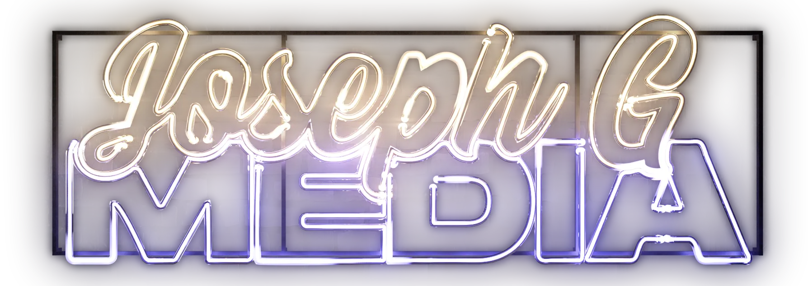
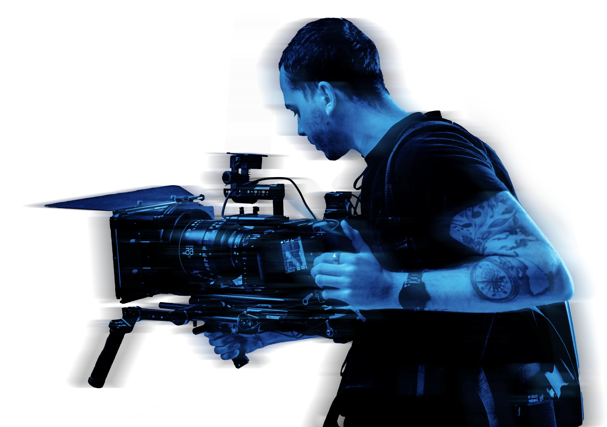

# SEO Quick Wins Implementation Guide

## Critical Fixes (Do These First - ~1 Hour Total)

### ✅ 1. Add Meta Descriptions (15 minutes)

#### index.html
Add after line 6 (`<title>Joseph G Media</title>`):

```html
<meta name="description" content="Senior motion designer in Sydney with 10+ years experience across broadcast, advertising, and live events for Saatchi & Saatchi, Omnicom, and The Electric Canvas. Specializing in motion graphics, 3D animation, and video production.">
```

#### work.html
Add after line 6 (`<title>Work - Joseph G Media</title>`):

```html
<meta name="description" content="Portfolio of motion design, 3D animation, and video production work for Ampol, Qantas, Nivea, Toyota, and more. View showreels and project galleries from Joseph G Media.">
```

---

### ✅ 2. Add Canonical Tags (5 minutes)

#### index.html
Add after the favicon line (currently line 7):

```html
<link rel="canonical" href="https://josephgmedia.com/">
```

#### work.html  
Add after line 6:

```html
<link rel="canonical" href="https://josephgmedia.com/work.html">
<link rel="icon" type="image/svg+xml" href="favicon.svg?v=2" />
```

---

### ✅ 3. Add Open Graph & Twitter Card Tags (15 minutes)

#### index.html
Add in `<head>` after meta description:

```html
<!-- Open Graph -->
<meta property="og:title" content="Joseph G Media | Motion Design & Video Production Sydney">
<meta property="og:description" content="Senior motion designer specializing in broadcast, advertising, and live events. 10+ years experience with leading agencies.">
<meta property="og:image" content="https://josephgmedia.com/src/assets/images/hero-sign/about.webp">
<meta property="og:url" content="https://josephgmedia.com/">
<meta property="og:type" content="website">
<meta property="og:site_name" content="Joseph G Media">

<!-- Twitter Card -->
<meta name="twitter:card" content="summary_large_image">
<meta name="twitter:title" content="Joseph G Media | Motion Design & Video Production">
<meta name="twitter:description" content="Senior motion designer in Sydney. 10+ years experience in broadcast, advertising, and live events.">
<meta name="twitter:image" content="https://josephgmedia.com/src/assets/images/hero-sign/about.webp">
```

#### work.html
Add in `<head>`:

```html
<!-- Open Graph -->
<meta property="og:title" content="Portfolio - Joseph G Media">
<meta property="og:description" content="Motion design and video production portfolio featuring work for Ampol, Qantas, Nivea, Toyota, and more.">
<meta property="og:image" content="https://josephgmedia.com/src/assets/images/gallery/qantas-100-01.webp">
<meta property="og:url" content="https://josephgmedia.com/work.html">
<meta property="og:type" content="website">

<!-- Twitter Card -->
<meta name="twitter:card" content="summary_large_image">
<meta name="twitter:title" content="Portfolio - Joseph G Media">
<meta name="twitter:description" content="Motion design and video production portfolio.">
<meta name="twitter:image" content="https://josephgmedia.com/src/assets/images/gallery/qantas-100-01.webp">
```

---

### ✅ 4. Optimize Title Tags (5 minutes)

#### index.html
Change line 6 from:
```html
<title>Joseph G Media</title>
```

To:
```html
<title>Joseph G Media | Motion Design & Video Production Sydney</title>
```

#### work.html
Change line 6 from:
```html
<title>Work - Joseph G Media</title>
```

To:
```html
<title>Portfolio - Motion Design & Video Work | Joseph G Media</title>
```

---

### ✅ 5. Fix Hero Images for Core Web Vitals (20 minutes)

#### index.html - Hero Image Optimization

**Line 26** - Add `fetchpriority="high"` and dimensions to the brick background:

**BEFORE:**
```html

```

**AFTER:**
```html

```

**Lines 36-37** - Add dimensions to sign images:

**BEFORE:**
```html


```

**AFTER:**
```html


```

---

### ✅ 6. Add Lazy Loading to Monitor Images

#### index.html - Timeline Monitor Images

Add `loading="lazy"` and `decoding="async"` to all monitor images (lines 150-163):

**Example (line 151):**

**BEFORE:**
```html

```

**AFTER:**
```html

```

Apply the same pattern to:
- `web.webp` - "Web design and development work samples"
- `genai.webp` - "AI and generative design work showcasing machine learning art"
- `photo-1.webp`, `photo-2.webp`, `photo-3.webp` - "Professional photography portfolio sample 1/2/3"

---

### ✅ 7. Add Lazy Loading to Brand Logos

#### index.html - Credits Section Marquee Logos

Add `loading="lazy"` to all marquee logos (lines 242-297):

**Example:**

**BEFORE:**
```html

```

**AFTER:**
```html

```

Apply to all logos in both marquee rows.

---

### ✅ 8. Add About Section Image Optimization

#### index.html - About Image (line 209)

**BEFORE:**
```html

```

**AFTER:**
```html

```

---

## Complete Head Section (index.html)

Here's what your complete `<head>` should look like after all fixes:

```html
<head>
  <meta charset="UTF-8" />
  <meta name="viewport" content="width=device-width, initial-scale=1.0" />
  <title>Joseph G Media | Motion Design & Video Production Sydney</title>
  <meta name="description" content="Senior motion designer in Sydney with 10+ years experience across broadcast, advertising, and live events for Saatchi & Saatchi, Omnicom, and The Electric Canvas. Specializing in motion graphics, 3D animation, and video production.">
  <link rel="canonical" href="https://josephgmedia.com/">
  <link rel="icon" type="image/svg+xml" href="favicon.svg?v=2" />

  <!-- Open Graph -->
  <meta property="og:title" content="Joseph G Media | Motion Design & Video Production Sydney">
  <meta property="og:description" content="Senior motion designer specializing in broadcast, advertising, and live events. 10+ years experience with leading agencies.">
  <meta property="og:image" content="https://josephgmedia.com/src/assets/images/hero-sign/about.webp">
  <meta property="og:url" content="https://josephgmedia.com/">
  <meta property="og:type" content="website">
  <meta property="og:site_name" content="Joseph G Media">

  <!-- Twitter Card -->
  <meta name="twitter:card" content="summary_large_image">
  <meta name="twitter:title" content="Joseph G Media | Motion Design & Video Production">
  <meta name="twitter:description" content="Senior motion designer in Sydney. 10+ years experience in broadcast, advertising, and live events.">
  <meta name="twitter:image" content="https://josephgmedia.com/src/assets/images/hero-sign/about.webp">

  <!-- Google Fonts -->
  <link rel="preconnect" href="https://fonts.googleapis.com" />
  <link rel="preconnect" href="https://fonts.gstatic.com" crossorigin />
  <link href="https://fonts.googleapis.com/css2?family=Barlow:ital,wght@0,300;0,400;0,500;1,300&display=swap" rel="stylesheet" />

  <!-- Stylesheet -->
  <link rel="stylesheet" href="src/css/main.css" />
</head>
```

---

## Validation Checklist

After implementing:

- [ ] Test meta tags: https://metatags.io/
- [ ] Test Open Graph: https://www.opengraph.xyz/
- [ ] Check mobile-friendliness: https://search.google.com/test/mobile-friendly
- [ ] Validate HTML: https://validator.w3.org/
- [ ] Test Core Web Vitals: https://pagespeed.web.dev/
- [ ] Preview social cards: https://cards-dev.twitter.com/validator

---

## Expected Impact

| Fix | Impact | Estimated Improvement |
|-----|--------|----------------------|
| Meta descriptions | CTR | +15-20% click-through rate |
| Title optimization | Rankings | Better keyword targeting |
| Canonical tags | Indexing | Prevent duplicate content issues |
| Open Graph | Social | Better social sharing appearance |
| Hero image optimization | LCP | -0.5 to -1.0 second improvement |
| Lazy loading | Performance | +5-10 performance score |

---

## Files Already Created

✅ **robots.txt** - AI crawler management + sitemap reference  
✅ **sitemap.xml** - XML sitemap for search engines  
✅ **SCHEMA-IMPLEMENTATION.md** - Schema markup code ready to copy

---

## Next Steps After Quick Wins

1. Review [SEO-AUDIT-REPORT.md](SEO-AUDIT-REPORT.md) for complete findings
2. Implement schema markup from [SCHEMA-IMPLEMENTATION.md](SCHEMA-IMPLEMENTATION.md)
3. Monitor performance in Google Search Console (after deployment)
4. Create content expansion plan (FAQ, blog, case studies)
